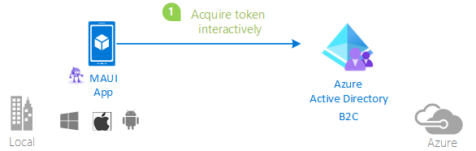

# A MAUI mobile or desktop application using Microsoft Entra ID for authentication

## About this sample

### Scenario

You have a mobile or Windows desktop application and you want it to consume either Microsoft Graph or your own Web API using the **Microsoft Identity Platform** to acquire tokens.

### Structure of the repository

This repository contains a three-part tutorial - a basic scenario, a more advanced with broker scenario and a scenario using Azure Active Directory B2C. Choose the one that best suits your scenario, or go through both to understand the differences between the implementations.

Sub folder                    | Description
----------------------------- | -----------
[MauiAppBasic](https://github.com/Azure-Samples/ms-identity-dotnetcore-maui/tree/main/MauiAppBasic) | This sample app shows how to use the Microsoft identity platform endpoint to sign-in a user interactively and display their profile </p> 
[MauiAppWithBroker](https://github.com/Azure-Samples/ms-identity-dotnetcore-maui/tree/main/MauiAppWithBroker)  | This chapter adds additional support for the broker (Microsoft Authenticator), which enables more complex scenarios, like device related conditional access and SSO. </p>  
[MauiAppB2C](https://github.com/Azure-Samples/ms-identity-dotnetcore-maui/tree/main/MauiAppB2C)  | This sample app shows how to use the Microsoft identity platform endpoint to sign-in a user interactively with Azure Active Directory B2C and display their access permissions </p>  

## How to run this sample for MAUI

To run this sample, you'll need:

- [Visual Studio](https://aka.ms/vsdownload). Install or update Visual Studio with the following workloads:
  - Universal Windows Platform Development
  - Mobile Development with .Net
  
  Then from the "Individual Components" tab, make sure these additional items are selected:
  - Android SDK setup (API level 27)
  - Windows 10 SDK (10.0.17134.0)
  - Android SDK level 27 (oreo) and 28 (pie), and Android SDK build tools 27.0.3 are also required. These are not installed through the VS Installer, so instead use the Android SDK Manager (Visual Studio > Tools > Android > Android SDK Manager…)
- An Internet connection
- A Windows or OS X machine (necessary if you want to run the app on their respective platforms)
- a Microsoft Entra tenant. For more information on how to get a Microsoft Entra tenant, see [How to get a Microsoft Entra tenant](https://azure.microsoft.com/en-us/documentation/articles/active-directory-howto-tenant/)
  - If you wish to run the B2C sample you will need an[Azure Active Directory B2C Tenant](https://learn.microsoft.com/azure/active-directory-b2c/tutorial-create-tenant)
- A user account in your Microsoft Entra tenant. This sample will not work with a Microsoft account (formerly Windows Live account). Therefore, if you signed in to the [Microsoft Entra admin center](https://entra.microsoft.com) with a Microsoft account and have never created a user account in your directory before, you need to do that now.
- Setup [MAUI](https://learn.microsoft.com/dotnet/maui/get-started/installation?tabs=vswin&view=net-maui-7.0). This will require Visual Studio on PC, and on a Mac Machine.

To run the sample on VS Code, you'll need:

- For iOS/Mac, A specific version of Xcode, which depends on the version of .NET MAUI that you're using is needed. For information, see [Release Versions](https://github.com/dotnet/maui/wiki/Release-Versions), make sure to install the iOS simulators during the xcode installation.
- [VS Code](https://code.visualstudio.com/download). Install or update Visual Studio Code.
  - In Visual Studio Code, in the Extensions tab, search for ".NET MAUI" and install the .NET MAUI extension. The .NET MAUI extension automatically installs the C# Dev Kit and C# extensions, which are required for the .NET MAUI extension to run.
- Install [.NET](https://learn.microsoft.com/en-us/dotnet/core/install/windows)
- Install the .NET MAUI workload.
  - Windows - dotnet workload install maui
  - Mac - sudo dotnet workload install maui
- While trying to build and launch the MAUI project on Mac, if you run into "Please Verify the Xcode Installation" Error, do the following:
  - In your Terminal, first run:
    $ /Applications/Xcode.app/Contents/Developer/usr/bin/simctl delete unavailable
  - Reboot the machine, then reopen your MAUI solution
- For iOS/Mac, setup provisioning on your device by following the below steps:
  - Open Xcode -> Settings -> Accounts, Add your Microsoft Apple ID
  - Click on "Download Manual Profiles" and wait for it to finish, this should download the certificates onto the machine.
- Open the MAUI project in VS Code, create .vscode/launch.json from the root folder and add ".NET MAUI" as the name of the launch configuration.
- For building the MAUI project, right click on the project in Solution Explorer and select "Build".
- For launching the MAUI sample app in VS Code, go to "Run and Debug", slect ".NET MAUI" in the Run as tab and click on "Start Debugging" icon.
- If we want to launch the sample app on an actual physical device/select a different iOS simulator device, click on the MAUI project in the solution explorer and then click on the curly braces('{}') in the bottom right corner, select "Debug Target", that should give a list of all the available physical devices and simulators.

### Step 1:  Clone or download this repository

From your shell or command line:

```Shell
git clone https://github.com/Azure-Samples/ms-identity-dotnetcore-maui.git
```

or download and exact the repository .zip file.

> Given that the name of the sample is pretty long, and so are the name of the referenced NuGet packages, you might want to clone it in a folder close to the root of your hard drive, to avoid file size limitations on Windows.

Then navigate to the sub-folder of your choice, [MauiAppBasic](./MauiAppBasic), [MauiAppWithBroker](./MauiAppWithBroker) or [MauiAppB2C](./MauiAppB2C)

## Community Help and Support

Use [Stack Overflow](http://stackoverflow.com/questions/tagged/msal) to get support from the community.
Ask your questions on Stack Overflow first and browse existing issues to see if someone has asked your question before.
Make sure that your questions or comments are tagged with [`msal` `dotnet`].

If you find a bug in the sample, please raise the issue on [GitHub Issues](../../issues).

If you find a bug in msal.Net, please raise the issue on [MSAL.NET GitHub Issues](https://github.com/AzureAD/microsoft-authentication-library-for-dotnet/issues).

To provide a recommendation, visit the following [User Voice page](https://feedback.azure.com/forums/169401-azure-active-directory).

## Contributing

If you'd like to contribute to this sample, see [CONTRIBUTING.MD](/CONTRIBUTING.md).

This project has adopted the [Microsoft Open Source Code of Conduct](https://opensource.microsoft.com/codeofconduct/). For more information, see the [Code of Conduct FAQ](https://opensource.microsoft.com/codeofconduct/faq/) or contact [opencode@microsoft.com](mailto:opencode@microsoft.com) with any additional questions or comments.

## More information

For more information, see MSAL.NET's conceptual documentation:

- [Mobile application scenario landing page](https://docs.microsoft.com/azure/active-directory/develop/scenario-mobile-overview)
- [Quickstart: Register an application with the Microsoft identity platform](https://docs.microsoft.com/azure/active-directory/develop/quickstart-register-app)
- [Quickstart: Configure a client application to access web APIs](https://docs.microsoft.com/azure/active-directory/develop/quickstart-configure-app-access-web-apis)
